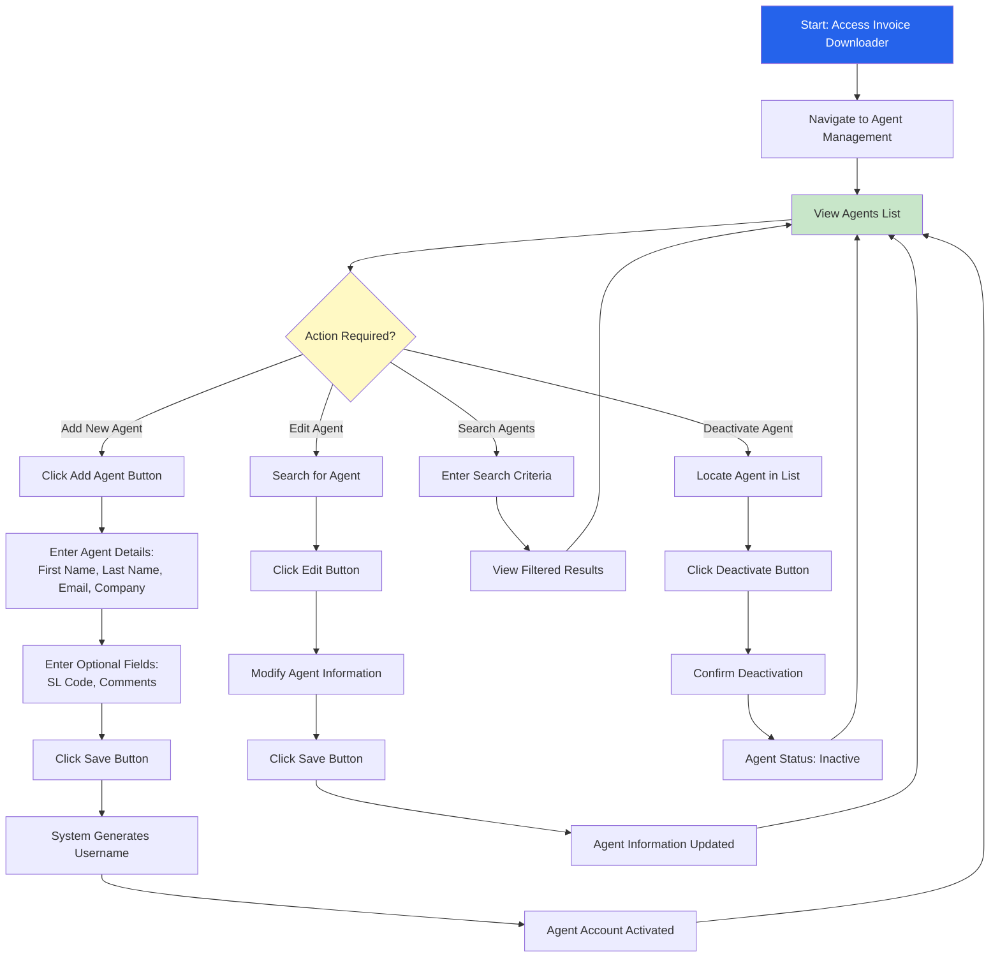
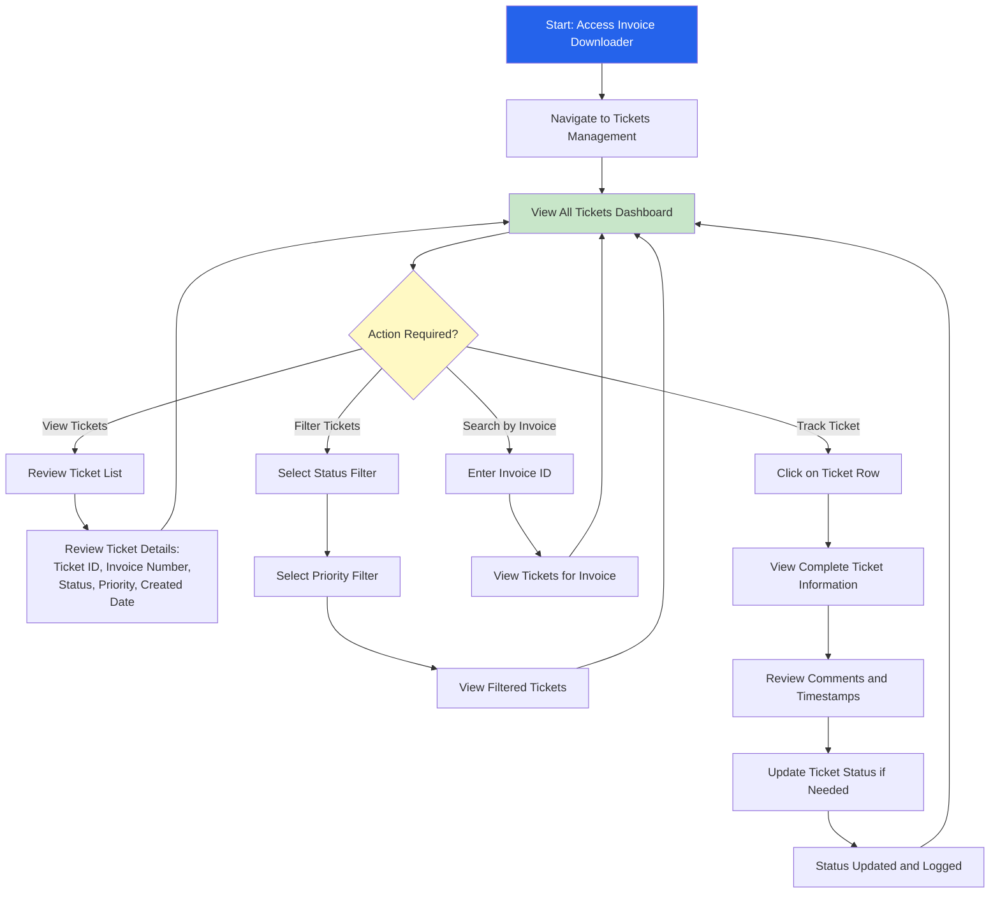
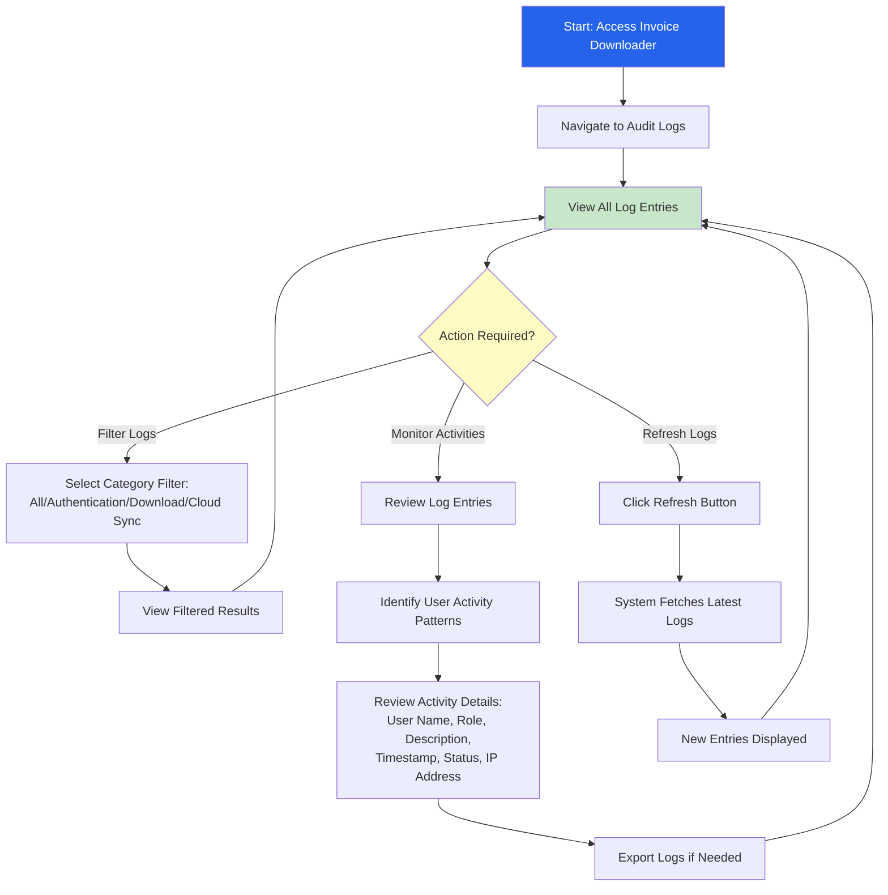
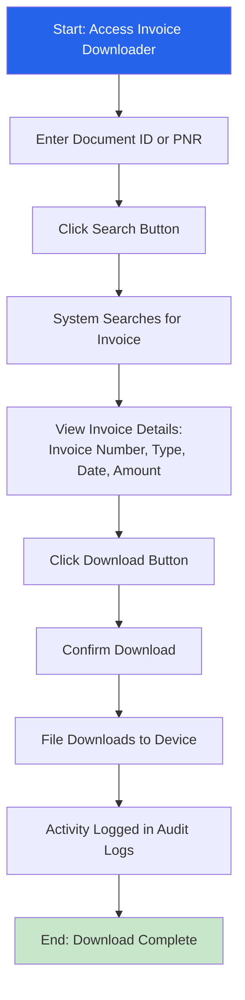
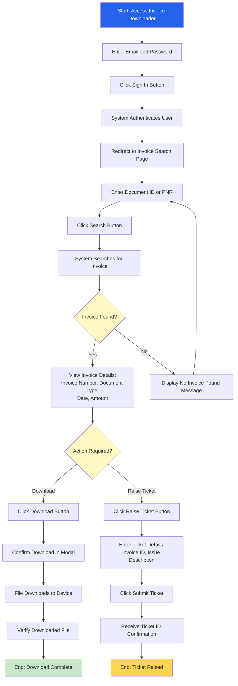
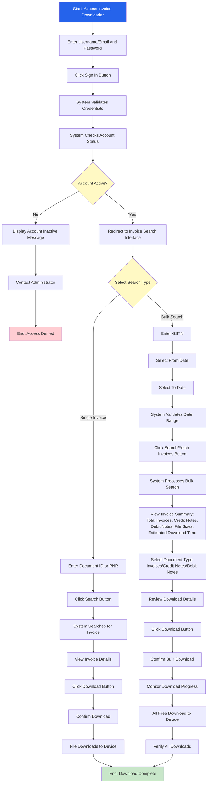
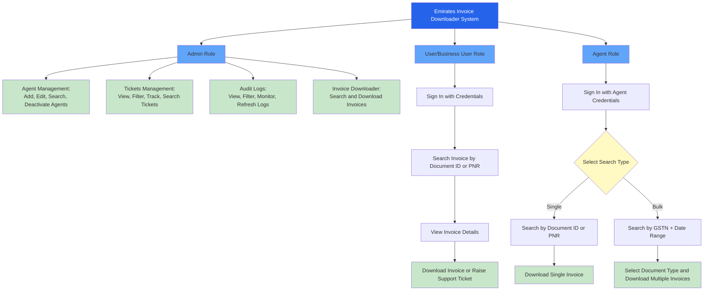

# Emirates Invoice Downloader - High-Level Workflow Diagrams

## Document Overview

This document contains simplified, high-level workflow diagrams for each user role in the Emirates Invoice Downloader system. These diagrams provide a clear overview of the main processes without detailed error handling or conditional branches.

**Document Version:** 1.0  
**Last Updated:** January 2025

---

## Administrator Workflow

### Agent Management Workflow

### Tickets Management Workflow

### Audit Logs Workflow

### Invoice Downloader Workflow (Admin)

---

## User / Business User Workflow

---

## Agent Workflow

---

## Complete System Overview

---

## Workflow Summary

### Administrator
- **Agent Management:** Create, edit, search, and manage agent accounts
- **Tickets Management:** View, filter, track, and manage support tickets
- **Audit Logs:** Monitor system activities and user actions
- **Invoice Downloader:** Search and download invoices with full audit visibility

### User / Business User
- **Sign In:** Authenticate to access the system
- **Search Invoice:** Find invoices using Document ID or PNR
- **Download Invoice:** Download individual invoices
- **Raise Support Ticket:** Create tickets for issues or queries

### Agent
- **Sign In:** Authenticate with active agent account
- **Single Invoice Search:** Search and download individual invoices
- **Bulk Search:** Search multiple invoices using GSTN and date range
- **Bulk Download:** Download multiple invoices by document type

---

*End of High-Level Workflow Diagrams*

**These simplified diagrams provide a quick overview of each role's capabilities without detailed decision points or error handling.*

